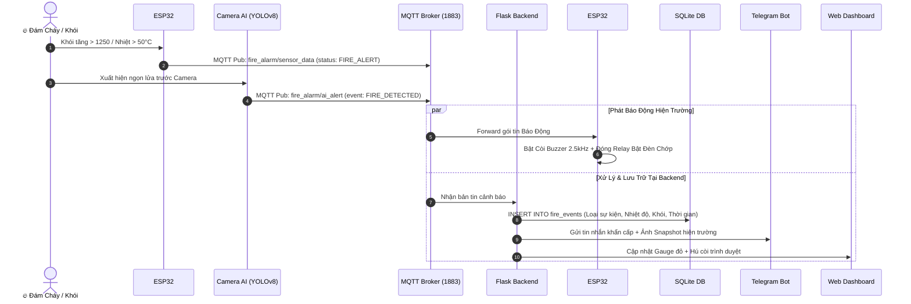
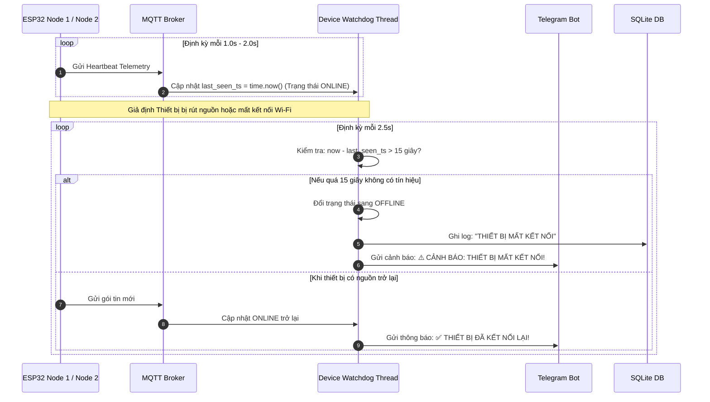

# 🏛️ TÀI LIỆU KIẾN TRÚC TOÀN DIỆN HỆ THỐNG BÁO CHÁY THÔNG MINH IOT
> **Dự án:** Hệ Thống Báo Cháy Thông Minh Đa Tầng IoT (Edge AI + Dual-Node ESP32-C3 + MQTT Local/Cloud + Flask Web + Telegram Alert)  
> **Kiến trúc:** Chuẩn 5 Tầng IoT Phân Tán (Field Nodes $\to$ Local Broker $\to$ Cloud Broker $\to$ Backend & DB $\to$ Web Dashboard $\to$ Điều Khiển 2 Chiều)  
> **Ngày cập nhật:** 2026-10-06  

---

## 🖼️ SƠ ĐỒ INFOGRAPHIC TRỰC QUAN TOÀN HỆ THỐNG


---

## 📌 MỤC LỤC
1. [Sơ Đồ Khối Tổng Thể 5 Tầng IoT (Mermaid Architecture)](#1-sơ-đồ-khối-tổng-thể-5-tầng-iot)
2. [Sơ Đồ Tuần Tự Luồng Dữ Liệu 2 Chiều (Sequence Diagrams)](#2-sơ-đồ-tuần-tự-luồng-dữ-liệu-2-chiều)
   - 2.1. Luồng Phát Hiện Cháy Tự Động (Telemetry & Detection Stream)
   - 2.2. Luồng Điều Khiển Can Thiệp Khẩn Cấp & SOS (Command & Actuation Stream)
   - 2.3. Luồng Giám Sát Nhịp Tim Thiết Bị (Device Heartbeat & Watchdog)
3. [Thiết Kế Giao Thức MQTT Topics](#3-thiết-kế-giao-thức-mqtt-topics)
4. [Sơ Đồ Đấu Nối Phần Cứng & Phân Bổ Chân (Hardware Pinout Map)](#4-sơ-đồ-đấu-nối-phần-cứng--phân-bổ-chân)
5. [Cấu Trúc Cơ Sở Dữ Liệu SQLite (Database Schema)](#5-cấu-trúc-cơ-sở-dữ-liệu-sqlite)
6. [Danh Mục Các Endpoint REST API](#6-danh-mục-các-endpoint-rest-api)

---

## 1. SƠ ĐỒ KHỐI TỔNG THỂ 5 TẦNG IOT

```mermaid
flowchart TB
    %% ==========================================
    %% TẦNG 1: THIẾT BỊ NGOẠI VI HIỆN TRƯỜNG
    %% ==========================================
    subgraph TIER1 ["🟢 TẦNG 1: THIẾT BỊ NGOẠI VI HIỆN TRƯỜNG (FIELD EDGE DEVICES)"]
        subgraph NODE1 ["Node 1: Trạm Thu Thập Cảm Biến Hiện Trường"]
            DS["🌡️ Cảm biến Nhiệt DS18B20\n(Chân DATA - GPIO 2)"]
            MQ["💨 Cảm biến Khói MQ-2\n(Chân Analog AO - GPIO 0)"]
            ESP1["Microcontroller ESP32-C3 #1\n(Wi-Fi STA + MQTT Client)"]
            
            DS -->|1-Wire Protocol| ESP1
            MQ -->|ADC1 Analog Reading| ESP1
        end

        subgraph NODE2 ["Node 2: Trạm Cảnh Báo Âm Thanh & Đèn Chớp Báo Động"]
            ESP2["Microcontroller ESP32-C3 #2\n(Wi-Fi STA + MQTT Client)"]
            BUZZ["🔊 Còi Báo Động Buzzer 5V\n(GPIO 6 - Active Tone)"]
            RELAY["⚡ Module Rơ-le 5V (GPIO 7)\n(Kích Active LOW)"]
            STROBE["🚨 Đèn LED Chớp Cảnh Báo\n(Tiếp điểm Relay COM-NO)"]
            
            ESP2 -->|Xung kích 2.5kHz| BUZZ
            ESP2 -->|Đóng/Ngắt Tải| RELAY --> STROBE
        end

        subgraph AICAM ["Camera AI Thị Giác Máy Tính"]
            YOLO["📷 AI Camera Vision Server\n(YOLOv8n Fire/Smoke Detector)"]
        end
    end

    %% ==========================================
    %% TẦNG 2: LOCAL MQTT BROKER
    %% ==========================================
    subgraph TIER2 ["⚡ TẦNG 2: TRẠM ĐIỀU PHỐI CỤC BỘ (LOCAL MQTT BROKER)"]
        LOCAL_BROKER["Mosquitto / AMQTT Local Broker\n(IP LAN: 192.168.11.150 : 1883 TCP)\n(WebSockets Port: 8083 WS)"]
    end

    %% ==========================================
    %% TẦNG 3: CLOUD MQTT BROKER
    %% ==========================================
    subgraph TIER3 ["☁️ TẦNG 3: ĐÁM MÂY TỪ XA (CLOUD MQTT BROKER)"]
        CLOUD_BROKER["Cloud MQTT Broker\n(broker.emqx.io : 1883)\nĐồng bộ dữ liệu đa vùng qua Internet"]
    end

    %% ==========================================
    %% TẦNG 4: BACKEND TRUNG TÂM & CƠ SỞ DỮ LIỆU
    %% ==========================================
    subgraph TIER4 ["💻 TẦNG 4: BACKEND XỬ LÝ TRUNG TÂM & DATABASE"]
        BACKEND["Flask RESTful API & Video Engine\n(Port 5001)"]
        WATCHDOG["⏱️ Device Heartbeat Watchdog\n(Phát hiện mất kết nối > 15s)"]
        TELEGRAM_SRV["📱 Telegram Alert Service\n(Gửi tin nhắn + Snapshot bất đồng bộ)"]
        DB[(SQLite Database\nfire_history.db\n• fire_events\n• users)]
        
        BACKEND <--> WATCHDOG
        BACKEND <--> TELEGRAM_SRV
        BACKEND <--> DB
    end

    %% ==========================================
    %% TẦNG 5: GIAO DIỆN NGƯỜI DÙNG
    %% ==========================================
    subgraph TIER5 ["🌐 TẦNG 5: GIAO DIỆN GIÁM SÁT & ĐIỀU KHIỂN"]
        DASHBOARD["🖥️ Web Dashboard Thời Gian Thực\n(Live Gauges, Chart, MJPEG Stream)"]
        HISTORY_UI["📜 Nhật Ký Sự Cố & Tra Cứu (/history)"]
        USERS_UI["👥 Quản Trị Phân Quyền RBAC (/users)"]
        TELEGRAM_APP["📲 Ứng Dụng Telegram Admin\n(Nhận cảnh báo khẩn kèm ảnh)"]
    end

    %% ==========================================
    %% CÁC LUỒNG DỮ LIỆU KẾT NỐI (DATA FLOW)
    %% ==========================================
    %% Luồng đẩy dữ liệu cảm biến & AI
    ESP1 ===|"(1) Pub: fire_alarm/sensor_data"| LOCAL_BROKER
    ESP2 ===|"(1b) Pub: fire_alarm/actuator_status"| LOCAL_BROKER
    YOLO ===|"(1c) Pub: fire_alarm/ai_alert"| LOCAL_BROKER
    
    %% Cơ chế Cầu nối MQTT Bridge
    LOCAL_BROKER <==. "(2) MQTT Bridge 2 Chiều (Sync)" .==> CLOUD_BROKER
    
    %% Luồng thu thập Backend
    LOCAL_BROKER ===|"(3) Sub toàn bộ Topics"| BACKEND
    
    %% Luồng Web & Telegram
    BACKEND ===|"(4) HTTP JSON + MJPEG Video Feed"| DASHBOARD
    BACKEND ===|"(4b) Render Bảng Lịch Sử & User"| HISTORY_UI & USERS_UI
    TELEGRAM_SRV ===|"(5) Bot API Push (HTML + Photo)"| TELEGRAM_APP

    %% Luồng điều khiển đi xuống (2 Chiều)
    DASHBOARD -.->|"(6) Lệnh Điều Khiển / SOS: /api/control"| BACKEND
    BACKEND -.->|"(7) Pub: fire_alarm/control"| LOCAL_BROKER
    LOCAL_BROKER -.->|"(8) Nhận lệnh & Kích Đèn / Còi"| ESP2
```

---

## 2. SƠ ĐỒ TUẦN TỰ LUỒNG DỮ LIỆU 2 CHIỀU

### 2.1. Luồng Phát Hiện Cháy Tự Động (Telemetry & Detection Stream)



---

### 2.2. Luồng Điều Khiển Can Thiệp Khẩn Cấp & SOS (Command & Actuation Stream)

```mermaid
sequenceDiagram
    autonumber
    actor Admin as 👤 Người Quản Trị
    participant Web as Web Dashboard
    participant Backend as Flask Backend
    participant DB as SQLite DB
    participant Broker as MQTT Broker
    participant Node2 as ESP32 #2 (Chấp hành)

    Admin->>Web: Nhấn nút "KÍCH HOẠT SOS" hoặc "BẬT CÒI/ĐÈN THỦ CÔNG"
    Web->>Backend: POST /api/sos hoặc POST /api/control {"relay":"ON","buzzer":"ON"}
    Backend->>DB: Ghi nhật ký: USER: admin đã kích hoạt điều khiển
    Backend->>Broker: MQTT Pub topic fire_alarm/control
    Broker->>Node2: Nhận lệnh điều khiển
    Node2->>Node2: Đóng Relay Bật Đèn Chớp + Phát Còi Báo Động
    Node2->>Broker: MQTT Pub: fire_alarm/actuator_status {"relay_state":"ON"}
    Broker->>Backend->>Web: Cập nhật trạng thái nút bấm trên Dashboard
```

---

### 2.3. Luồng Giám Sát Nhịp Tim Thiết Bị (Device Heartbeat & Watchdog)



---

## 3. THIẾT KẾ GIAO THỨC MQTT TOPICS

| Topic | Hướng Truyền | Định Dạng Payload Mẫu (JSON) | Mục Đích |
| :--- | :--- | :--- | :--- |
| `fire_alarm/sensor_data` | ESP32 #1 $\to$ Broker | `{"node":"node_1_sensor", "temperature":25.50, "smoke":700, "smoke_pct":15.0, "status":"NORMAL", "uptime":220}` | Dữ liệu cảm biến chu kỳ 1.0s |
| `fire_alarm/actuator_status` | ESP32 #2 $\to$ Broker | `{"buzzer_state":"OFF", "relay_state":"OFF", "mode":"AUTO"}` | Định kỳ 2.0s báo cáo trạng thái chấp hành |
| `fire_alarm/ai_alert` | Camera AI $\to$ Broker | `{"event":"FIRE_DETECTED", "fire_detected":true, "confidence":0.92, "action":"TRIGGER_ALARM"}` | Báo động phát hiện lửa/khói từ AI |
| `fire_alarm/control` | Web/Backend $\to$ ESP32 | `{"relay":"ON", "buzzer":"ON", "mode":"MANUAL", "temp_threshold":50.0, "smoke_threshold":1250}` | Lệnh điều khiển và đồng bộ ngưỡng cảnh báo |

---

## 4. SƠ ĐỒ ĐẤU NỐI PHẦN CỨNG & PHÂN BỔ CHÂN

```text
========================================================================================
                          SƠ ĐỒ ĐẤU NỐI PHẦN CỨNG CHI TIẾT
========================================================================================

    [ ESP32-C3 SUPER MINI #1 ]                         [ ESP32-C3 SUPER MINI #2 ]
     (Trạm Đo Cảm Biến Hiện Trường)                       (Trạm Còi & Rơ-le Đèn Báo Động)
    ┌──────────────────────────────┐                   ┌──────────────────────────────┐
    │ GPIO 0  ──> Cảm biến Khói MQ2│ (Chân AO)         │ GPIO 6  ──> Còi Buzzer 5V    │ (+)
    │ GPIO 2  ──> DS18B20 Nhiệt độ │ (Chân DATA)       │ GPIO 7  ──> Module Relay 5V  │ (Chân IN)
    │ 3.3V    ──> VCC DS18B20      │                   │ GND     ──> Chân Âm Còi & Rơ-le
    │ 5V(VBUS)──> VCC Cảm biến MQ-2│                   │ 5V(VBUS)──> VCC Relay & Nguồn Còi
    │ GND     ──> GND chung        │                   │ Tiếp Điểm NO ──> Đèn Chớp LED│
    └──────────────────────────────┘                   └──────────────────────────────┘
```

---

## 5. CẤU TRÚC CƠ SỞ DỮ LIỆU SQLITE

Database file: `fire_history.db`

### 🔹 Bảng 1: `fire_events` (Nhật ký sự kiện & cảnh báo)
```sql
CREATE TABLE IF NOT EXISTS fire_events (
    id INTEGER PRIMARY KEY AUTOINCREMENT,
    timestamp TEXT NOT NULL,          -- Thời gian xảy ra sự cố (YYYY-MM-DD HH:MM:SS)
    event_type TEXT NOT NULL,         -- Loại sự kiện (CẢNH BÁO CHÁY, SOS, ĐIỀU KHIỂN TỪ XA, THIẾT BỊ MẤT KẾT NỐI,...)
    temperature REAL,                 -- Nhiệt độ tại thời điểm ghi nhận (°C)
    smoke INTEGER,                    -- Nồng độ khói tại thời điểm ghi nhận (ADC)
    source TEXT NOT NULL,             -- Nguồn kích hoạt (CẢM BIẾN, AI CAMERA, USER: admin,...)
    details TEXT                      -- Chi tiết sự kiện / Lệnh gửi đi
);
```

### 🔹 Bảng 2: `users` (Quản lý tài khoản & phân quyền)
```sql
CREATE TABLE IF NOT EXISTS users (
    id INTEGER PRIMARY KEY AUTOINCREMENT,
    username TEXT UNIQUE NOT NULL,    -- Tên đăng nhập
    password_hash TEXT NOT NULL,      -- Mật khẩu băm (Werkzeug pbkdf2:sha256)
    fullname TEXT,                    -- Họ và tên hiển thị
    role TEXT DEFAULT 'ADMIN',        -- Vai trò (ADMIN, OPERATOR, VIEWER)
    telegram_chat_id TEXT,            -- Chat ID nhận thông báo riêng
    created_at TEXT NOT NULL          -- Ngày tạo tài khoản
);
```

---

## 6. DANH MỤC CÁC ENDPOINT REST API

| Method | Endpoint URL | Phân Quyền | Chức Năng |
| :---: | :--- | :---: | :--- |
| `GET` | `/api/status` | Public | Lấy toàn bộ trạng thái cảm biến, AI, thiết bị và cấu hình hệ thống |
| `POST` | `/api/control` | `@login_required` | Gửi lệnh điều khiển bật/tắt Relay, Buzzer, chuyển chế độ Auto/Manual |
| `POST` | `/api/sos` | `@login_required` | Kích hoạt báo động SOS khẩn cấp, đóng Relay, hú còi và gửi Telegram |
| `POST` | `/api/thresholds` | `ADMIN` | Cập nhật ngưỡng nhiệt độ/khói và đồng bộ qua MQTT tới ESP32 |
| `GET` | `/api/history` | `@login_required` | Truy xuất 100 sự kiện lịch sử gần nhất từ database SQLite |
| `POST` | `/api/history/clear` | `ADMIN` | Xóa sạch toàn bộ lịch sử trong SQLite |
| `POST` | `/api/telegram/test` | `@login_required` | Gửi tin nhắn và ảnh test kết nối Telegram |
| `POST` | `/api/telegram/send_snapshot` | `@login_required` | Chụp ngay ảnh hiện trường từ AI Camera gửi qua Telegram |
| `GET` | `/video_feed` | Public | Luồng MJPEG Video Stream thời gian thực kèm HUD phân tích AI |
| `POST` | `/api/auth/login` | Public | Xác thực đăng nhập và khởi tạo phiên người dùng |
| `POST` | `/api/auth/register` | Public | Đăng ký tài khoản người dùng mới |
| `GET` | `/api/admin/users` | `ADMIN` | Lấy danh sách toàn bộ người dùng trong hệ thống |
| `POST` | `/api/admin/users/role` | `ADMIN` | Cập nhật quyền hạn (Role) và Telegram Chat ID của người dùng |
| `DELETE`| `/api/admin/users/<id>` | `ADMIN` | Xóa tài khoản người dùng khỏi hệ thống |
