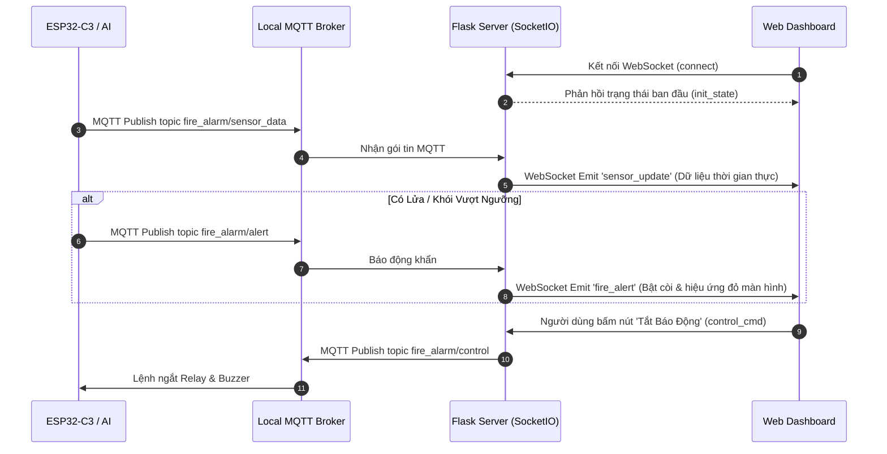

# 🔥 BẢN KẾ HOẠCH TOÀN DIỆN: HỆ THỐNG BÁO CHÁY THÔNG MINH IOT (EDGE-TO-CLOUD)
> **Phiên bản:** 2.0 (Kiến trúc Local Broker Bridge + Cloud Sync + Real-time WebSockets + AI Camera Detection)  
> **Tác giả:** Nhóm Phát Triển Dự Án Cuối Kỳ IoT  
> **Thời gian cập nhật:** 2026-10-02  

---

## 📌 MỤC LỤC
1. [Tổng Quan Dự Án & Kiến Trúc Đột Phá](#1-tổng-quan-dự-án--kiến-trúc-đột-phá)
2. [Sơ Đồ Khối Hệ Thống (Mermaid Architecture)](#2-sơ-đồ-khối-hệ-thống-mermaid-architecture)
3. [Sơ Đồ Đấu Nối Phần Cứng Toàn Diện (Hardware Wiring)](#3-sơ-đồ-đấu-nối-phần-cứng-toàn-diện-hardware-wiring)
4. [Kiến Trúc Local Broker "Bridge" Lên Cloud Broker](#4-kiến-trúc-local-broker-bridge-lên-cloud-broker)
5. [Hệ Thống WebSocket Giám Sát Thời Gian Thực (Sub-second Latency)](#5-hệ-thống-websocket-giám-sát-thời-gian-thực)
6. [Tích Hợp Trí Tuệ Nhân Tạo (AI Vision Fire & Smoke Detection)](#6-tích-hợp-trí-tuệ-nhân-tạo-ai-vision-fire--smoke-detection)
7. [Thiết Kế Giao Thức & Danh Sách Topics MQTT](#7-thiết-kế-giao-thức--danh-sách-topics-mqtt)
8. [Kế Hoạch Triển Khai & Các Kịch Bản Thử Nghiệm (Test Scenarios)](#8-kế-hoạch-triển-khai--các-kịch-bản-thử-nghiệm)

---

## 1. TỔNG QUAN DỰ ÁN & KIẾN TRÚC ĐỘT PHÁ

Dự án xây dựng một **Hệ Thống Cảnh Báo & Dập Tắt Cháy Sớm Đa Tầng**, kết hợp giữa:
1. **Tầng Thiết Bị Ngoại Vi Hiện Trường (Edge IoT Hardware):** ESP32-C3 Super Mini thu thập nồng độ khói/gas (MQ-2), nhiệt độ môi trường (DS18B20), hiển thị trực quan (OLED SSD1306), cảnh báo âm thanh (Còi Buzzer) và kích hoạt thiết bị dập lửa / Đèn chớp cảnh báo (Relay 5V).
2. **Tầng Trạm Xử Lý Cục Bộ Hiện Trường (Local Edge Station):** Chạy **Local MQTT Broker (Mosquitto/Embedded Broker)** tại mạng LAN hiện trường kết hợp mô hình AI YOLOv8. Giúp hệ thống phản ứng **dưới 10ms** và **hoạt động độc lập 100% ngay cả khi đứt cáp Internet**.
3. **Cơ Chế "Bridge" Đồng Bộ Lên Cloud:** Local Broker tự động bắt cầu (Bridge) dữ liệu sang Cloud Broker (HiveMQ Cloud / EMQX Cloud) khi có Internet để đồng bộ dữ liệu cho người quản trị từ xa.
4. **Giao Tiếp WebSocket Thời Gian Thực:** Máy chủ web đẩy dữ liệu cảm biến, trạng thái báo cháy và luồng video AI trực tiếp xuống trình duyệt người dùng qua **WebSocket 2 chiều**, không sử dụng kỹ thuật Polling gây trễ.

---

## 2. SƠ ĐỒ KHỐI HỆ THỐNG (MERMAID ARCHITECTURE)

```mermaid
flowchart TB
    subgraph EDGE_FIELD ["📍 TẦNG HIỆN TRƯỜNG (LOCAL EDGE LAYER)"]
        subgraph HARDWARE ["Thiết Bị Phần Cứng"]
            ESP32["Vi điều khiển ESP32-C3"]
            MQ2["Cảm biến Khói MQ-2\n(GPIO 0)"]
            DS18["Cảm biến Nhiệt DS18B20\n(GPIO 2)"]
            OLED["Màn hình OLED 0.96\n(GPIO 4/5)"]
            BUZZER["Còi Buzzer 2 chân\n(GPIO 6)"]
            RELAY["Module Relay 5V\n(GPIO 7)"]
            STROBE["Đèn Chớp Cảnh Báo\n(Nối qua Relay COM-NO)"]

            MQ2 -->|Analog| ESP32
            DS18 -->|1-Wire| ESP32
            ESP32 -->|I2C| OLED
            ESP32 -->|Mức HIGH| BUZZER
            ESP32 -->|Kích Relay| RELAY --> STROBE
        end

        subgraph LOCAL_SERVER ["Máy Trạm Hiện Trường (Local Edge Server)"]
            AI_CAM["📷 AI Camera Engine\n(YOLOv8 Fire/Smoke)"]
            LOCAL_BROKER["⚡ Local MQTT Broker\n(Port 1883 - LAN)"]
            WEB_SERVER["💻 Flask Backend Server\n+ WebSocket Handler"]
        end

        ESP32 <==>|MQTT over Wi-Fi LAN| LOCAL_BROKER
        AI_CAM -->|Phát hiện Lửa/Khói| LOCAL_BROKER
        LOCAL_BROKER <==> WEB_SERVER
    end

    subgraph CLOUD_LAYER ["☁️ TẦNG ĐÁM MÂY (CLOUD LAYER)"]
        CLOUD_BROKER["🌐 Cloud MQTT Broker\n(EMQX / HiveMQ Cloud)"]
    end

    subgraph CLIENT_APPS ["📱 GIAO DIỆN GIÁM SÁT THỜI GIAN THỰC"]
        BROWSER_LOCAL["Trình duyệt LAN\n(WebSocket trực tiếp)"]
        BROWSER_REMOTE["Trình duyệt Từ Xa / Mobile\n(Cloud Sync)"]
        DB[(SQLite History DB)]
    end

    %% Cơ chế Bridge
    LOCAL_BROKER <==. "MQTT Bridge 2 Chiều\n(Tự động Reconnect)" .==> CLOUD_BROKER
    
    %% WebSocket Stream
    WEB_SERVER ===|WebSocket Push (Real-time)| BROWSER_LOCAL
    CLOUD_BROKER ===> BROWSER_REMOTE
    WEB_SERVER --> DB
```

---

## 3. SƠ ĐỒ ĐẤU NỐI PHẦN CỨNG TOÀN DIỆN (HARDWARE WIRING)

### 3.1. Nguyên Lý Cấp Nguồn Tổng Toàn Hệ Thống (Power Distribution)

```
[ Củ Sạc 5V / Cổng USB Máy Tính / Sạc Dự Phòng ]
                     │
                     ▼ (Cắm Cáp USB Type-C)
     ┌───────────────────────────────┐
     │   BOARD ESP32-C3 SUPER MINI   │
     │  (Nhận nguồn 5V & Hạ áp 3.3V) │
     └───────┬───────┬───────┬───────┘
             │       │       │
      (Chân GND) (Chân 5V) (Chân 3.3V)
             │       │       │  (Dùng 3 sợi Dây Cái - Đực)
             ▼       ▼       ▼
     ┌───────────────────────────────┐
     │  BREADBOARD MINI 170 LỖ (HUB) │
     │  Hàng 1: Trạm GND (Mass chung)│
     │  Hàng 3: Trạm 5V (Nguồn 5V)   │
     │  Hàng 4: Trạm 3.3V (Nguồn 3V3)│
     └───────┬───────┬───────┬───────┘
             │       │       │  (Cấp điện ra các module)
             ▼       ▼       ▼
       [OLED, MQ-2, DS18B20, Buzzer, Relay, Đèn Chớp]
```

> 💡 **CÁCH CẮM NGUỒN CỤ THỂ:**
> 1. Bạn **chỉ cần cắm 1 sợi cáp USB Type-C** từ củ sạc (hoặc máy tính) vào cổng Type-C của **ESP32-C3**.
> 2. ESP32-C3 sẽ tự lấy nguồn 5V này đưa ra chân **`5V` (VBUS)** và hạ áp qua chip nguồn trên board đưa ra chân **`3.3V`**.
> 3. Bạn dùng **3 sợi dây Cái - Đực** cắm từ 3 chân `GND`, `5V`, `3.3V` của ESP32 sang **Breadboard** để biến Breadboard thành trạm cấp nguồn cho tất cả các cảm biến còn lại!

---

### 3.2. Phân Bổ Trạm Nguồn Trên Breadboard Mini 170 Lỗ (SYB-170)
Breadboard 170 lỗ có các hàng 5 lỗ ngắn. Quy ước sử dụng 4 hàng ngang cùng phía:

```
====================== BREADBOARD 170 LỖ ======================
HÀNG 1 [Trạm GND - Nhóm 1] : [Lỗ 1: ESP32-GND] [Lỗ 2: OLED-GND] [Lỗ 3: MQ2-GND] [Lỗ 4: DS18-GND] [Lỗ 5: Cầu Nối]
                                                                                                    │ (Dây Đực-Đực)
HÀNG 2 [Trạm GND - Nhóm 2] : [Lỗ 1: Cầu Nối]   [Lỗ 2: Buzzer-GND] [Lỗ 3: Relay-GND] [Lỗ 4: Đèn-GND]  [Trống]
---------------------------------------------------------------
HÀNG 3 [Trạm 5V Chung]     : [Lỗ 1: ESP32-5V]  [Lỗ 2: MQ2-VCC]    [Lỗ 3: Relay-VCC]  [Lỗ 4: Nguồn Đèn] [Trống]
---------------------------------------------------------------
HÀNG 4 [Trạm 3.3V Chung]   : [Lỗ 1: ESP32-3V3] [Lỗ 2: OLED-VCC]   [Lỗ 3: DS18-VCC]   [Trống]           [Trống]
===============================================================
```

---

### 3.3. Bảng Đấu Nối Chi Tiết Từng Bước (Full 6 Thiết Bị)

| STT | Thiết Bị Ngoại Vi | Chân Thiết Bị | Nối Đến Đâu? | Loại Dây | Chức Năng / Lưu Ý |
| :---: | :--- | :--- | :--- | :---: | :--- |
| **0** | **Cầu Nối Nguồn** | Hàng 1 Breadboard | Hàng 2 Breadboard | **Đực - Đực** | Mở rộng trạm GND thành 8 lỗ cắm |
| | **Cấp Nguồn Từ ESP32 Vào Breadboard** | **GND** (ESP32)<br>**5V / VBUS** (ESP32)<br>**3.3V / 3V3** (ESP32) | **Hàng 1** (GND)<br>**Hàng 3** (5V)<br>**Hàng 4** (3.3V) | **Cái - Đực**<br>**Cái - Đực**<br>**Cái - Đực** | Kéo 3 đường nguồn từ ESP32-C3 vào Breadboard |
| **1** | 🖥️ **Màn Hình OLED 0.96"**<br>*(SSD1306 I2C)* | **GND**<br>**VCC**<br>**SDA**<br>**SCL** | **Hàng 1** (GND)<br>**Hàng 4** (3.3V)<br>**GPIO 4** (ESP32)<br>**GPIO 5** (ESP32) | **Đực - Cái**<br>**Đực - Cái**<br>**Cái - Cái**<br>**Cái - Cái** | Hiển thị nhiệt độ, nồng độ khói và trạng thái "FIRE ALERT" |
| **2** | 💨 **Cảm Biến Khói MQ-2** | **GND**<br>**VCC**<br>**AO** (Analog)<br>*DO* | **Hàng 1** (GND)<br>**Hàng 3** (5V)<br>**GPIO 0** (ESP32)<br>*(Bỏ trống)* | **Đực - Cái**<br>**Đực - Cái**<br>**Cái - Cái**<br>- | Bắt buộc nguồn 5V để sấy buồng cảm biến. Đọc nồng độ khói/khí gas. |
| **3** | 🌡️ **Module DS18B20**<br>*(Loại mạch 3 chân)* | **-** (GND)<br>**+** (VCC)<br>**S** (Signal) | **Hàng 1** (GND)<br>**Hàng 4** (3.3V)<br>**GPIO 2** (ESP32) | **Đực - Cái**<br>**Đực - Cái**<br>**Cái - Cái** | Mạch đã có sẵn trở kéo 4.7kΩ. Đọc nhiệt độ chính xác qua chuẩn 1-Wire. |
| **4** | 🔊 **Còi Buzzer (2 chân)** | **Chân Âm (-)** *(Ngắn)*<br>**Chân Dương (+)** *(Dài)* | **Hàng 2** (GND)<br>**GPIO 6** (ESP32) | **Cái - Đực**<br>**Cái - Cái** | Phát âm thanh bíp bíp ngắt quãng khi phát hiện sự cố. |
| **5** | 🚰 **Module Relay 5V** | **GND**<br>**VCC**<br>**IN** (Kích tín hiệu) | **Hàng 2** (GND)<br>**Hàng 3** (5V)<br>**GPIO 7** (ESP32) | **Đực - Cái**<br>**Đực - Cái**<br>**Cái - Cái** | Đóng ngắt thiết bị tải ngoài. |
| **6** | 🚨 **Đèn LED Chớp Cảnh Báo**<br>*(Strobe Light)* | **Dây Dương (+)**<br>**Tiếp Điểm NO Relay**<br>**Dây Âm (-)** | **Chân COM** của Relay<br>**Hàng 3 (5V)** Breadboard<br>**Hàng 2 (GND)** Breadboard | **Cái - Đực**<br>**Đực - Đực**<br>**Cái - Đực** | Khi Relay đóng $\to$ Đèn chớp sáng liên tục báo động thị giác. |

---

## 4. KIẾN TRÚC LOCAL BROKER "BRIDGE" LÊN CLOUD BROKER

### 4.1. Nguyên Lý Hoạt Động (Edge-First Architecture)
* **Tại hiện trường (LAN):** ESP32-C3 và AI Camera kết nối tới **Local MQTT Broker** (`localhost:1883` hoặc IP máy trạm `192.168.x.x`). Tốc độ truyền tin đạt dưới 5ms, triệt tiêu độ trễ mạng Internet.
* **Cơ chế Bridge:** Local Broker cấu hình tính năng `connection bridge-to-cloud`. Khi có kết nối Internet, Local Broker tự động sao chép (forward) các topic `fire_alarm/#` lên Cloud Broker và ngược lại.
* **Chống mất kết nối (Offline Resilient):** Nếu đứt mạng Internet, toàn bộ hệ thống còi, đèn, màn hình OLED, camera AI và dashboard nội bộ vẫn hoạt động bình thường 100%.

### 4.2. Cấu Hình Mẫu Cho Mosquitto Bridge (`mosquitto.conf`)
```ini
# Cấu hình Local Listener
listener 1883
allow_anonymous true

# Cấu hình Bridge đồng bộ lên Cloud
connection bridge-cloud-sync
address broker.emqx.io:1883
# address <your-hivemq-cluster>.s1.eu.hivemq.cloud:8883 (Nếu dùng TLS)
clientid local_fire_alarm_edge_gateway
start_type automatic
try_private false
cleansession false
notifications true

# Đồng bộ 2 chiều các topic báo cháy (QoS 1)
topic fire_alarm/# both 1
```

---

## 5. HỆ THỐNG WEBSOCKET GIÁM SÁT THỜI GIAN THỰC

### 5.1. So Sánh Kiến Trúc HTTP Polling vs WebSocket
* ❌ **HTTP Polling (Cũ):** Trình duyệt gửi request mỗi giây $\to$ Tốn băng thông, tải CPU server cao, độ trễ 1-2 giây.
* ✅ **WebSocket Push (Mới):** Duy trì 1 kết nối song công (Full-duplex). Server chủ động đẩy dữ liệu ngay khi cảm biến gửi về hoặc AI phát hiện cháy với độ trễ **< 50ms**.

### 5.2. Danh Sách Sự Kiện WebSocket (Socket.IO Events)



---

## 6. TÍCH HỢP TRÍ TUỆ NHÂN TẠO (AI VISION FIRE & SMOKE DETECTION)

1. **Mô Hình Sử Dụng:** `rabahdev/fire-smoke-yolov8n` (YOLOv8 Nano tối ưu hóa tốc độ cao cho thiết bị Edge).
2. **Luồng Xử Lý AI:**
   * Thu thập frame từ Webcam / RTSP Camera.
   * Xử lý dự đoán (Inference time ~ 30-50ms trên CPU/GPU).
   * Vẽ bounding box: Viền **ĐỎ** cho `FIRE` (Ngọn lửa), Viền **CAM** cho `SMOKE` (Khói).
   * Gửi tín hiệu trực tiếp vào Local MQTT Broker khi `Confidence >= 0.65` liên tục 3 frames.

---

## 7. THIẾT KẾ GIAO THỨC & DANH SÁCH TOPICS MQTT

| Topic | Hướng Truyền | Payload Mẫu (JSON) | Chu Kỳ / Kích Hoạt |
| :--- | :--- | :--- | :--- |
| `fire_alarm/sensor_data` | ESP32 $\to$ Local Broker $\to$ Cloud | `{"temp": 32.5, "smoke": 450, "is_fire": false, "relay": 0, "buzzer": 0, "uptime": 340}` | 1.0 giây / lần |
| `fire_alarm/ai_alert` | Python AI $\to$ Local Broker $\to$ Cloud | `{"event": "FIRE_DETECTED", "label": "fire", "confidence": 0.92, "timestamp": 1727839400}` | Khi phát hiện lửa |
| `fire_alarm/control` | Web/Cloud $\to$ Local Broker $\to$ ESP32 | `{"relay": "ON", "buzzer": "OFF", "mode": "MANUAL"}` | Theo lệnh người dùng |
| `fire_alarm/system_status` | Server $\to$ Web Clients | `{"local_broker": "CONNECTED", "cloud_bridge": "ONLINE", "fps": 28}` | 2.0 giây / lần |

---

## 8. KẾ HOẠCH TRIỂN KHAI & CÁC KỊCH BẢN THỬ NGHIỆM

### 8.1. Các Giai Đoạn Triển Khai (Roadmap)
* [x] **Giai đoạn 1:** Lắp ráp phần cứng hoàn chỉnh theo sơ đồ 6 bước.
* [x] **Giai đoạn 2:** Nạp firmware `esp32_fire_alarm.ino` với kết nối Local MQTT Broker.
* [ ] **Giai đoạn 3:** Cài đặt Local Mosquitto Broker + Cấu hình Bridge đồng bộ Cloud.
* [ ] **Giai đoạn 4:** Nâng cấp `app.py` tích hợp `Flask-SocketIO` phục vụ WebSocket thời gian thực.
* [ ] **Giai đoạn 5:** Cập nhật giao diện `index.html` nhận luồng WebSocket và hiển thị biểu đồ trực tiếp.

### 8.2. Kịch Bản Thử Nghiệm Nghiệm Thu (Acceptance Test)
1. **Kịch bản 1 (Test Cảm Biến Cục Bộ):** Đưa đầu que nhang/bật lửa lại gần MQ-2 và DS18B20 $\to$ ESP32 hú còi, OLED hiển thị chữ báo động, Relay bật Đèn chớp, Dashboard Web cập nhật ngay tức khắc qua WebSocket.
2. **Kịch bản 2 (Test AI Camera):** Bật lửa trước Webcam $\to$ AI nhận diện `FIRE`, bắn tín hiệu sang Local Broker $\to$ ESP32 nhận lệnh và kích hoạt còi báo động toàn tòa nhà.
3. **Kịch bản 3 (Test Mất Internet):** Rút dây mạng/Tắt Wi-Fi ngoài $\to$ Toàn bộ hệ thống hiện trường (ESP32 + Cảm biến + Còi + Đèn + Web nội bộ) vẫn phản ứng 100% thời gian thực. Khi cắm mạng lại, dữ liệu tự động Bridge lên Cloud.
